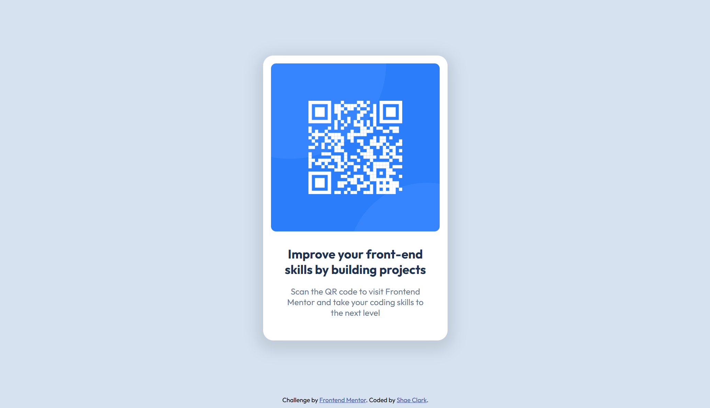

# Frontend-Mentor-Project-01-QR-Code
Very quick and casual redo of an old project I struggled with 6 months ago. Not pixel-perfect, not true responsive.

# Frontend Mentor - QR code component solution

This is a solution to the [QR code component challenge on Frontend Mentor](https://www.frontendmentor.io/challenges/qr-code-component-iux_sIO_H). Frontend Mentor challenges help you improve your coding skills by building realistic projects. 

## Table of contents

- [Overview](#overview)
  - [Screenshot](#screenshot)
  - [Links](#links)
- [My process](#my-process)
  - [Built with](#built-with)
  - [What I learned](#what-i-learned)
- [Author](#author)
- [Acknowledgments](#acknowledgments)

## Overview

I did this project shy of 6 months ago and it was a frustrating, all-day project at the time where I was battling with a lot of conflicts in styling. 
Wanted to take a break today from doing real work related to my work's intranet and see if I made any improvements since. 
Lot faster, smoother experience. decided to post it to progress on frontend mentor because I don't see a way to skip ahead.

NOTE: I do not consider this a completed solution. Description calls for a responsive design and this only got build out to 325px, supposed to work down to 280px.
Additionally, I did not run up Figma and go aiming for pixel-perfect remake. Wanted to see how much better my eyeballing got.

### Screenshot

### Built with

- Semantic HTML5 markup
- CSS custom properties
- Flexbox
- CSS Grid

### What I learned

Practice leads to progress. This project was mostly done in literally 10 minutes. Next 10 minutes was just fiddling with a couple margins and arguing with myself if I should make the box shadow I like or the box shadow I think is prettier.
Compare that to my experience half a year ago and I feel bold enough to say I might have learned a little since. 

My work experience reflects where I need to improve. Since I am getting professional experience building only desktop toolsets, I am not nearly as comfortable with responsive design as I wish to be. 
Will work towards that soon, but I have other aspects of I more immediately want to improve on. Namely I am focusing right now on improving design pattern implementation.

I am glad I did not give up and that six months later I was here to boast how much easier this felt. I hope in another six months to scoff at how lazy I was to not be pixel perfect or implement responsive design.
Anyone besides myself reading this, please go peak at one of the many incredible online resources for a more comprehensive solution to this problem, and most importantly, don't stop learning. 

Seriously, don't stop learning. 
Coding is hard, don't let anyone lie to you that it isn't. But it is worth it to learn something that you find difficult. Whether that thing is coding or any other thing that sparks something in you, please let that curiosity drive you.

### Continued development

I think it would be nice to come back to this and do another attempt while using figma, go for pixel-perfect, all that jazz. 
Also would like to make it meet WCAG requirements since I don't like the idea someone may find some of my code and take it as a good example when I haven't done the work for that.

## Author

- Frontend Mentor - [@MalakDynamics](https://www.frontendmentor.io/profile/MalakDynamics)

## Acknowledgments

Thanks to Frontend Mentor for all the assets and practice projects!
